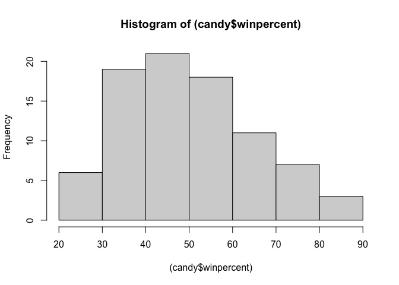
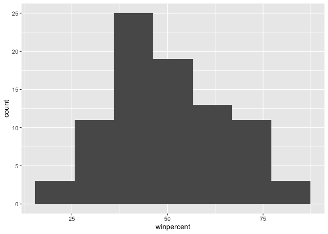
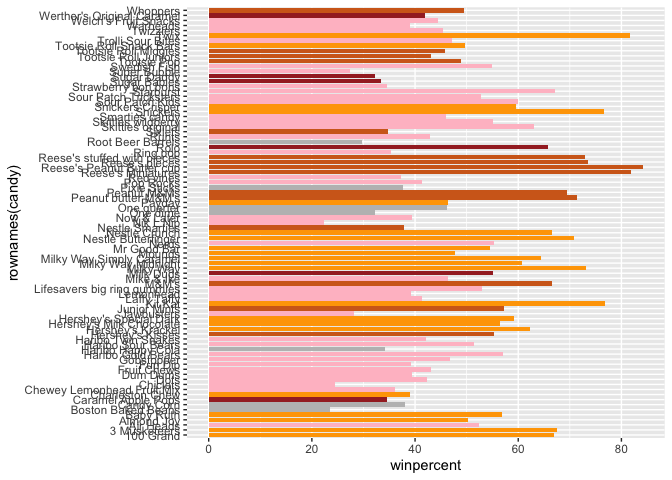
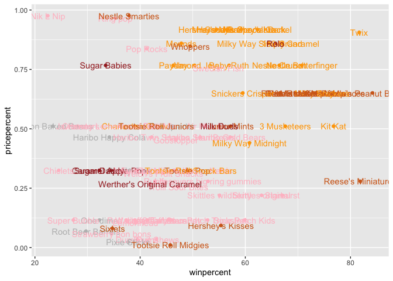
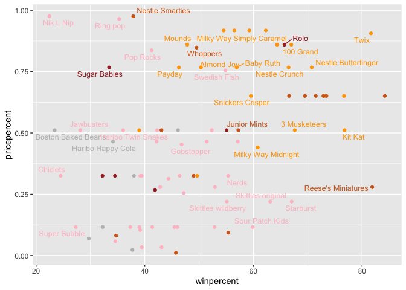
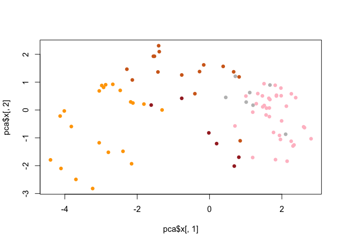
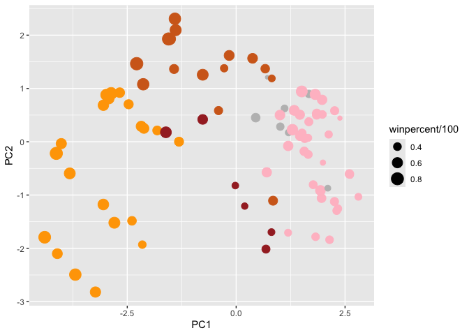
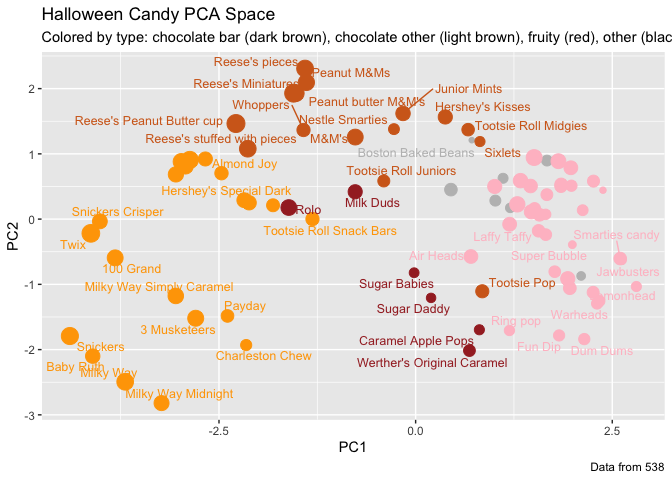
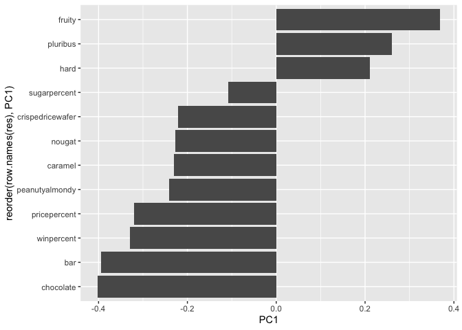

# Class09: Candy Analysis Mini Project
Norhan Turki (PID: A15671667)

In today’s class, we will examine some data about candy from the 538
website.

``` r
read.csv("candy-data.csv")
```

                    competitorname chocolate fruity caramel peanutyalmondy nougat
    1                    100 Grand         1      0       1              0      0
    2                 3 Musketeers         1      0       0              0      1
    3                     One dime         0      0       0              0      0
    4                  One quarter         0      0       0              0      0
    5                    Air Heads         0      1       0              0      0
    6                   Almond Joy         1      0       0              1      0
    7                    Baby Ruth         1      0       1              1      1
    8           Boston Baked Beans         0      0       0              1      0
    9                   Candy Corn         0      0       0              0      0
    10          Caramel Apple Pops         0      1       1              0      0
    11             Charleston Chew         1      0       0              0      1
    12  Chewey Lemonhead Fruit Mix         0      1       0              0      0
    13                    Chiclets         0      1       0              0      0
    14                        Dots         0      1       0              0      0
    15                    Dum Dums         0      1       0              0      0
    16                 Fruit Chews         0      1       0              0      0
    17                     Fun Dip         0      1       0              0      0
    18                  Gobstopper         0      1       0              0      0
    19           Haribo Gold Bears         0      1       0              0      0
    20           Haribo Happy Cola         0      0       0              0      0
    21           Haribo Sour Bears         0      1       0              0      0
    22          Haribo Twin Snakes         0      1       0              0      0
    23            Hershey's Kisses         1      0       0              0      0
    24           Hershey's Krackel         1      0       0              0      0
    25    Hershey's Milk Chocolate         1      0       0              0      0
    26      Hershey's Special Dark         1      0       0              0      0
    27                  Jawbusters         0      1       0              0      0
    28                Junior Mints         1      0       0              0      0
    29                     Kit Kat         1      0       0              0      0
    30                 Laffy Taffy         0      1       0              0      0
    31                   Lemonhead         0      1       0              0      0
    32 Lifesavers big ring gummies         0      1       0              0      0
    33         Peanut butter M&M's         1      0       0              1      0
    34                       M&M's         1      0       0              0      0
    35                  Mike & Ike         0      1       0              0      0
    36                   Milk Duds         1      0       1              0      0
    37                   Milky Way         1      0       1              0      1
    38          Milky Way Midnight         1      0       1              0      1
    39    Milky Way Simply Caramel         1      0       1              0      0
    40                      Mounds         1      0       0              0      0
    41                 Mr Good Bar         1      0       0              1      0
    42                       Nerds         0      1       0              0      0
    43         Nestle Butterfinger         1      0       0              1      0
    44               Nestle Crunch         1      0       0              0      0
    45                   Nik L Nip         0      1       0              0      0
    46                 Now & Later         0      1       0              0      0
    47                      Payday         0      0       0              1      1
    48                 Peanut M&Ms         1      0       0              1      0
    49                Pixie Sticks         0      0       0              0      0
    50                   Pop Rocks         0      1       0              0      0
    51                   Red vines         0      1       0              0      0
    52          Reese's Miniatures         1      0       0              1      0
    53   Reese's Peanut Butter cup         1      0       0              1      0
    54              Reese's pieces         1      0       0              1      0
    55 Reese's stuffed with pieces         1      0       0              1      0
    56                    Ring pop         0      1       0              0      0
    57                        Rolo         1      0       1              0      0
    58           Root Beer Barrels         0      0       0              0      0
    59                       Runts         0      1       0              0      0
    60                     Sixlets         1      0       0              0      0
    61           Skittles original         0      1       0              0      0
    62          Skittles wildberry         0      1       0              0      0
    63             Nestle Smarties         1      0       0              0      0
    64              Smarties candy         0      1       0              0      0
    65                    Snickers         1      0       1              1      1
    66            Snickers Crisper         1      0       1              1      0
    67             Sour Patch Kids         0      1       0              0      0
    68       Sour Patch Tricksters         0      1       0              0      0
    69                   Starburst         0      1       0              0      0
    70         Strawberry bon bons         0      1       0              0      0
    71                Sugar Babies         0      0       1              0      0
    72                 Sugar Daddy         0      0       1              0      0
    73                Super Bubble         0      1       0              0      0
    74                Swedish Fish         0      1       0              0      0
    75                 Tootsie Pop         1      1       0              0      0
    76        Tootsie Roll Juniors         1      0       0              0      0
    77        Tootsie Roll Midgies         1      0       0              0      0
    78     Tootsie Roll Snack Bars         1      0       0              0      0
    79           Trolli Sour Bites         0      1       0              0      0
    80                        Twix         1      0       1              0      0
    81                   Twizzlers         0      1       0              0      0
    82                    Warheads         0      1       0              0      0
    83        Welch's Fruit Snacks         0      1       0              0      0
    84  Werther's Original Caramel         0      0       1              0      0
    85                    Whoppers         1      0       0              0      0
       crispedricewafer hard bar pluribus sugarpercent pricepercent winpercent
    1                 1    0   1        0        0.732        0.860   66.97173
    2                 0    0   1        0        0.604        0.511   67.60294
    3                 0    0   0        0        0.011        0.116   32.26109
    4                 0    0   0        0        0.011        0.511   46.11650
    5                 0    0   0        0        0.906        0.511   52.34146
    6                 0    0   1        0        0.465        0.767   50.34755
    7                 0    0   1        0        0.604        0.767   56.91455
    8                 0    0   0        1        0.313        0.511   23.41782
    9                 0    0   0        1        0.906        0.325   38.01096
    10                0    0   0        0        0.604        0.325   34.51768
    11                0    0   1        0        0.604        0.511   38.97504
    12                0    0   0        1        0.732        0.511   36.01763
    13                0    0   0        1        0.046        0.325   24.52499
    14                0    0   0        1        0.732        0.511   42.27208
    15                0    1   0        0        0.732        0.034   39.46056
    16                0    0   0        1        0.127        0.034   43.08892
    17                0    1   0        0        0.732        0.325   39.18550
    18                0    1   0        1        0.906        0.453   46.78335
    19                0    0   0        1        0.465        0.465   57.11974
    20                0    0   0        1        0.465        0.465   34.15896
    21                0    0   0        1        0.465        0.465   51.41243
    22                0    0   0        1        0.465        0.465   42.17877
    23                0    0   0        1        0.127        0.093   55.37545
    24                1    0   1        0        0.430        0.918   62.28448
    25                0    0   1        0        0.430        0.918   56.49050
    26                0    0   1        0        0.430        0.918   59.23612
    27                0    1   0        1        0.093        0.511   28.12744
    28                0    0   0        1        0.197        0.511   57.21925
    29                1    0   1        0        0.313        0.511   76.76860
    30                0    0   0        0        0.220        0.116   41.38956
    31                0    1   0        0        0.046        0.104   39.14106
    32                0    0   0        0        0.267        0.279   52.91139
    33                0    0   0        1        0.825        0.651   71.46505
    34                0    0   0        1        0.825        0.651   66.57458
    35                0    0   0        1        0.872        0.325   46.41172
    36                0    0   0        1        0.302        0.511   55.06407
    37                0    0   1        0        0.604        0.651   73.09956
    38                0    0   1        0        0.732        0.441   60.80070
    39                0    0   1        0        0.965        0.860   64.35334
    40                0    0   1        0        0.313        0.860   47.82975
    41                0    0   1        0        0.313        0.918   54.52645
    42                0    1   0        1        0.848        0.325   55.35405
    43                0    0   1        0        0.604        0.767   70.73564
    44                1    0   1        0        0.313        0.767   66.47068
    45                0    0   0        1        0.197        0.976   22.44534
    46                0    0   0        1        0.220        0.325   39.44680
    47                0    0   1        0        0.465        0.767   46.29660
    48                0    0   0        1        0.593        0.651   69.48379
    49                0    0   0        1        0.093        0.023   37.72234
    50                0    1   0        1        0.604        0.837   41.26551
    51                0    0   0        1        0.581        0.116   37.34852
    52                0    0   0        0        0.034        0.279   81.86626
    53                0    0   0        0        0.720        0.651   84.18029
    54                0    0   0        1        0.406        0.651   73.43499
    55                0    0   0        0        0.988        0.651   72.88790
    56                0    1   0        0        0.732        0.965   35.29076
    57                0    0   0        1        0.860        0.860   65.71629
    58                0    1   0        1        0.732        0.069   29.70369
    59                0    1   0        1        0.872        0.279   42.84914
    60                0    0   0        1        0.220        0.081   34.72200
    61                0    0   0        1        0.941        0.220   63.08514
    62                0    0   0        1        0.941        0.220   55.10370
    63                0    0   0        1        0.267        0.976   37.88719
    64                0    1   0        1        0.267        0.116   45.99583
    65                0    0   1        0        0.546        0.651   76.67378
    66                1    0   1        0        0.604        0.651   59.52925
    67                0    0   0        1        0.069        0.116   59.86400
    68                0    0   0        1        0.069        0.116   52.82595
    69                0    0   0        1        0.151        0.220   67.03763
    70                0    1   0        1        0.569        0.058   34.57899
    71                0    0   0        1        0.965        0.767   33.43755
    72                0    0   0        0        0.418        0.325   32.23100
    73                0    0   0        0        0.162        0.116   27.30386
    74                0    0   0        1        0.604        0.755   54.86111
    75                0    1   0        0        0.604        0.325   48.98265
    76                0    0   0        0        0.313        0.511   43.06890
    77                0    0   0        1        0.174        0.011   45.73675
    78                0    0   1        0        0.465        0.325   49.65350
    79                0    0   0        1        0.313        0.255   47.17323
    80                1    0   1        0        0.546        0.906   81.64291
    81                0    0   0        0        0.220        0.116   45.46628
    82                0    1   0        0        0.093        0.116   39.01190
    83                0    0   0        1        0.313        0.313   44.37552
    84                0    1   0        0        0.186        0.267   41.90431
    85                1    0   0        1        0.872        0.848   49.52411

``` r
candy_file <- "candy-data.csv"
candy = read.csv(candy_file, row.names=1)
head(candy)
```

                 chocolate fruity caramel peanutyalmondy nougat crispedricewafer
    100 Grand            1      0       1              0      0                1
    3 Musketeers         1      0       0              0      1                0
    One dime             0      0       0              0      0                0
    One quarter          0      0       0              0      0                0
    Air Heads            0      1       0              0      0                0
    Almond Joy           1      0       0              1      0                0
                 hard bar pluribus sugarpercent pricepercent winpercent
    100 Grand       0   1        0        0.732        0.860   66.97173
    3 Musketeers    0   1        0        0.604        0.511   67.60294
    One dime        0   0        0        0.011        0.116   32.26109
    One quarter     0   0        0        0.011        0.511   46.11650
    Air Heads       0   0        0        0.906        0.511   52.34146
    Almond Joy      0   1        0        0.465        0.767   50.34755

> Q1. How many different candy types are in this dataset?

There are 85 different candy types in the dataset.

There are 85 in this dataset.

``` r
nrow(candy)
```

    [1] 85

> Q. How many chocolate candy types are in the dataset?

There are 37 chocolate candy types in the dataset.

There are 37 chocolate candy types in the dataset.

``` r
sum(candy$chocolate)
```

    [1] 37

> Q2. How many fruity candy types are in the dataset?

There are 38 fruity candy types in the dataset.

There are 38 fruity candy types in this dataset.

``` r
sum(candy$fruity)
```

    [1] 38

> Q3. What is your favorite candy in the dataset and what is it’s
> winpercent value?

My favorite candy is Snickers, and the winpecent value is 76.67378

``` r
candy["Snickers", ]$winpercent
```

    [1] 76.67378

> Q4. What is the winpercent value for “Kit Kat”?

76.7686

``` r
candy["Kit Kat", ]$winpercent
```

    [1] 76.7686

> Q5. What is the winpercent value for “Tootsie Roll Snack Bars”?

49.6535

``` r
candy["Tootsie Roll Snack Bars", ]$winpercent
```

    [1] 49.6535

Installation of the skimr package in order to use the `skim()` function.
`install.packages("skimr")`

``` r
skimr::skim(candy)
```

|                                                  |       |
|:-------------------------------------------------|:------|
| Name                                             | candy |
| Number of rows                                   | 85    |
| Number of columns                                | 12    |
| \_\_\_\_\_\_\_\_\_\_\_\_\_\_\_\_\_\_\_\_\_\_\_   |       |
| Column type frequency:                           |       |
| numeric                                          | 12    |
| \_\_\_\_\_\_\_\_\_\_\_\_\_\_\_\_\_\_\_\_\_\_\_\_ |       |
| Group variables                                  | None  |

Data summary

**Variable type: numeric**

| skim_variable    | n_missing | complete_rate |  mean |    sd |    p0 |   p25 |   p50 |   p75 |  p100 | hist  |
|:-----------------|----------:|--------------:|------:|------:|------:|------:|------:|------:|------:|:------|
| chocolate        |         0 |             1 |  0.44 |  0.50 |  0.00 |  0.00 |  0.00 |  1.00 |  1.00 | ▇▁▁▁▆ |
| fruity           |         0 |             1 |  0.45 |  0.50 |  0.00 |  0.00 |  0.00 |  1.00 |  1.00 | ▇▁▁▁▆ |
| caramel          |         0 |             1 |  0.16 |  0.37 |  0.00 |  0.00 |  0.00 |  0.00 |  1.00 | ▇▁▁▁▂ |
| peanutyalmondy   |         0 |             1 |  0.16 |  0.37 |  0.00 |  0.00 |  0.00 |  0.00 |  1.00 | ▇▁▁▁▂ |
| nougat           |         0 |             1 |  0.08 |  0.28 |  0.00 |  0.00 |  0.00 |  0.00 |  1.00 | ▇▁▁▁▁ |
| crispedricewafer |         0 |             1 |  0.08 |  0.28 |  0.00 |  0.00 |  0.00 |  0.00 |  1.00 | ▇▁▁▁▁ |
| hard             |         0 |             1 |  0.18 |  0.38 |  0.00 |  0.00 |  0.00 |  0.00 |  1.00 | ▇▁▁▁▂ |
| bar              |         0 |             1 |  0.25 |  0.43 |  0.00 |  0.00 |  0.00 |  0.00 |  1.00 | ▇▁▁▁▂ |
| pluribus         |         0 |             1 |  0.52 |  0.50 |  0.00 |  0.00 |  1.00 |  1.00 |  1.00 | ▇▁▁▁▇ |
| sugarpercent     |         0 |             1 |  0.48 |  0.28 |  0.01 |  0.22 |  0.47 |  0.73 |  0.99 | ▇▇▇▇▆ |
| pricepercent     |         0 |             1 |  0.47 |  0.29 |  0.01 |  0.26 |  0.47 |  0.65 |  0.98 | ▇▇▇▇▆ |
| winpercent       |         0 |             1 | 50.32 | 14.71 | 22.45 | 39.14 | 47.83 | 59.86 | 84.18 | ▃▇▆▅▂ |

> Q6. Is there any variable/column that looks to be on a different scale
> to the majority of the other columns in the dataset?

Winpercent looks to be on a different scale (large whole numbers 0-100
scale) than the majority of the columns in the dataset that seem to be
in 0-1 scale/percenatges). Extra: Comparison between the two types would
be harder because they are not on the same scale.

> Q7. What do you think a zero and one represent for the
> candy\$chocolate column?

The zero represents a “no” the candy does not contain chocolate and the
1 represents a “yes” the candy does contain chocolate.

> Q8a. Plot a histogram of winpercent values

``` r
hist((candy$winpercent))
```



> Q8b. Plot a histogram of winpercent values using ggplot

``` r
library(ggplot2)
```

``` r
ggplot(candy) +
  aes(winpercent) +
  geom_histogram(bins = 7)
```



> Q9. Is the distribution of winpercent values symmetrical?

No the distribution is not symmetrical.

> Q10. Is the center of the distribution above or below 50%?

The center is below 50%.

``` r
mean(candy$winpercent)
```

    [1] 50.31676

``` r
summary(candy$winpercent)
```

       Min. 1st Qu.  Median    Mean 3rd Qu.    Max. 
      22.45   39.14   47.83   50.32   59.86   84.18 

> Q11. On average is chocolate candy higher or lower ranked than fruit
> candy?

Chocolate candy is higher ranked with a mean of 60.92153 than fruity
candy, which has a mean of 44.11974.

- first find all chocolate candy
- find their winpercent values
- calculate the mean of these values

``` r
chocolate.inds <- candy$chocolate == 1
chocolate.win <- candy[chocolate.inds,]$winpercent
mean(chocolate.win)
```

    [1] 60.92153

- then, do the same for fruity candy and compare with the mean for
  chocolate candy.

``` r
fruity.inds <- as.logical(candy$fruity)
fruity.win <- candy[fruity.inds,]$winpercent
mean(fruity.win)
```

    [1] 44.11974

> Q12. Is this difference statistically significant?

The difference is statistically significant because of the small p-value
of 2.871e-08.

``` r
t.test(chocolate.win, fruity.win)
```


        Welch Two Sample t-test

    data:  chocolate.win and fruity.win
    t = 6.2582, df = 68.882, p-value = 2.871e-08
    alternative hypothesis: true difference in means is not equal to 0
    95 percent confidence interval:
     11.44563 22.15795
    sample estimates:
    mean of x mean of y 
     60.92153  44.11974 

The order function is very useful for this and it returns the indices
that make the input sorted. \> Q13. What are the five least liked candy
types in this set?

Nik L Nip, Boston Baked Beans, Chiclets,Super Bubble, and Jawbusters are
the five least liked candy types in this set.

``` r
inds<- order(candy$winpercent)
head(candy[inds,])
```

                       chocolate fruity caramel peanutyalmondy nougat
    Nik L Nip                  0      1       0              0      0
    Boston Baked Beans         0      0       0              1      0
    Chiclets                   0      1       0              0      0
    Super Bubble               0      1       0              0      0
    Jawbusters                 0      1       0              0      0
    Root Beer Barrels          0      0       0              0      0
                       crispedricewafer hard bar pluribus sugarpercent pricepercent
    Nik L Nip                         0    0   0        1        0.197        0.976
    Boston Baked Beans                0    0   0        1        0.313        0.511
    Chiclets                          0    0   0        1        0.046        0.325
    Super Bubble                      0    0   0        0        0.162        0.116
    Jawbusters                        0    1   0        1        0.093        0.511
    Root Beer Barrels                 0    1   0        1        0.732        0.069
                       winpercent
    Nik L Nip            22.44534
    Boston Baked Beans   23.41782
    Chiclets             24.52499
    Super Bubble         27.30386
    Jawbusters           28.12744
    Root Beer Barrels    29.70369

``` r
head(candy[order(candy$winpercent),], n=5)
```

                       chocolate fruity caramel peanutyalmondy nougat
    Nik L Nip                  0      1       0              0      0
    Boston Baked Beans         0      0       0              1      0
    Chiclets                   0      1       0              0      0
    Super Bubble               0      1       0              0      0
    Jawbusters                 0      1       0              0      0
                       crispedricewafer hard bar pluribus sugarpercent pricepercent
    Nik L Nip                         0    0   0        1        0.197        0.976
    Boston Baked Beans                0    0   0        1        0.313        0.511
    Chiclets                          0    0   0        1        0.046        0.325
    Super Bubble                      0    0   0        0        0.162        0.116
    Jawbusters                        0    1   0        1        0.093        0.511
                       winpercent
    Nik L Nip            22.44534
    Boston Baked Beans   23.41782
    Chiclets             24.52499
    Super Bubble         27.30386
    Jawbusters           28.12744

> Q14. What are the top 5 all time favorite candy types out of this set?

Reese’s Peanut Butter cup, Reese’s Miniatures, Twix, Kit Kat, and
Snickers are the top 5 all time favorite candy types of this set.

``` r
tail(candy[order(candy$winpercent),], n=5)
```

                              chocolate fruity caramel peanutyalmondy nougat
    Snickers                          1      0       1              1      1
    Kit Kat                           1      0       0              0      0
    Twix                              1      0       1              0      0
    Reese's Miniatures                1      0       0              1      0
    Reese's Peanut Butter cup         1      0       0              1      0
                              crispedricewafer hard bar pluribus sugarpercent
    Snickers                                 0    0   1        0        0.546
    Kit Kat                                  1    0   1        0        0.313
    Twix                                     1    0   1        0        0.546
    Reese's Miniatures                       0    0   0        0        0.034
    Reese's Peanut Butter cup                0    0   0        0        0.720
                              pricepercent winpercent
    Snickers                         0.651   76.67378
    Kit Kat                          0.511   76.76860
    Twix                             0.906   81.64291
    Reese's Miniatures               0.279   81.86626
    Reese's Peanut Butter cup        0.651   84.18029

> Q15. Make a first barplot of candy ranking based on winpercent values.

``` r
library(ggplot2)
```

``` r
ggplot(candy) + 
  aes(winpercent, rownames(candy),) +
  geom_col()
```


> Q16. This is quite ugly, use the reorder() function to get the bars
> sorted by winpercent?

``` r
ggplot(candy) + 
  aes(winpercent, reorder(rownames(candy),winpercent)) +
  geom_col()
```


``` r
ggsave("mybarplot.png", height=10)
```

    Saving 7 x 10 in image


I will add colors to my barplot

``` r
my_cols=rep("grey", nrow(candy))
my_cols[candy$fruity == 1] <- "pink"
my_cols[candy$chocolate ==1] <- "chocolate"
my_cols[candy$caramel ==1] <- "brown"
my_cols[candy$bar ==1] <- "orange"
my_cols
```

     [1] "orange"    "orange"    "grey"      "grey"      "pink"      "orange"   
     [7] "orange"    "grey"      "grey"      "brown"     "orange"    "pink"     
    [13] "pink"      "pink"      "pink"      "pink"      "pink"      "pink"     
    [19] "pink"      "grey"      "pink"      "pink"      "chocolate" "orange"   
    [25] "orange"    "orange"    "pink"      "chocolate" "orange"    "pink"     
    [31] "pink"      "pink"      "chocolate" "chocolate" "pink"      "brown"    
    [37] "orange"    "orange"    "orange"    "orange"    "orange"    "pink"     
    [43] "orange"    "orange"    "pink"      "pink"      "orange"    "chocolate"
    [49] "grey"      "pink"      "pink"      "chocolate" "chocolate" "chocolate"
    [55] "chocolate" "pink"      "brown"     "grey"      "pink"      "chocolate"
    [61] "pink"      "pink"      "chocolate" "pink"      "orange"    "orange"   
    [67] "pink"      "pink"      "pink"      "pink"      "brown"     "brown"    
    [73] "pink"      "pink"      "chocolate" "chocolate" "chocolate" "orange"   
    [79] "pink"      "orange"    "pink"      "pink"      "pink"      "brown"    
    [85] "chocolate"

``` r
ggplot(candy) + 
  aes(winpercent, rownames(candy),) +
  geom_col(fill=my_cols)
```



> Q17. What is the worst ranked chocolate candy?

> Q18. What is the best ranked fruity candy?

Plot of winpercent vs pricepercent

``` r
ggplot(candy) +
  aes(winpercent, pricepercent, label=rownames(candy)) +
  geom_point(col=my_cols) +
  geom_text(col=my_cols) 
```



There are just too many labels in the plot above, and it is not
readable. We can use the `ggrepel` package to do a better job of placing
labels so thry minimize text overlap

``` r
library(ggrepel)

ggplot(candy) +
  aes(winpercent, pricepercent, label=rownames(candy)) +
  geom_point(col=my_cols) +
  geom_text_repel(col=my_cols, max.overlaps = 5, size=3.3) 
```

    Warning: ggrepel: 50 unlabeled data points (too many overlaps). Consider
    increasing max.overlaps



## Exploring the correlation structure

``` r
library(corrplot)
```

    corrplot 0.92 loaded

``` r
cij <- cor(candy)
cij
```

                      chocolate      fruity     caramel peanutyalmondy      nougat
    chocolate         1.0000000 -0.74172106  0.24987535     0.37782357  0.25489183
    fruity           -0.7417211  1.00000000 -0.33548538    -0.39928014 -0.26936712
    caramel           0.2498753 -0.33548538  1.00000000     0.05935614  0.32849280
    peanutyalmondy    0.3778236 -0.39928014  0.05935614     1.00000000  0.21311310
    nougat            0.2548918 -0.26936712  0.32849280     0.21311310  1.00000000
    crispedricewafer  0.3412098 -0.26936712  0.21311310    -0.01764631 -0.08974359
    hard             -0.3441769  0.39067750 -0.12235513    -0.20555661 -0.13867505
    bar               0.5974211 -0.51506558  0.33396002     0.26041960  0.52297636
    pluribus         -0.3396752  0.29972522 -0.26958501    -0.20610932 -0.31033884
    sugarpercent      0.1041691 -0.03439296  0.22193335     0.08788927  0.12308135
    pricepercent      0.5046754 -0.43096853  0.25432709     0.30915323  0.15319643
    winpercent        0.6365167 -0.38093814  0.21341630     0.40619220  0.19937530
                     crispedricewafer        hard         bar    pluribus
    chocolate              0.34120978 -0.34417691  0.59742114 -0.33967519
    fruity                -0.26936712  0.39067750 -0.51506558  0.29972522
    caramel                0.21311310 -0.12235513  0.33396002 -0.26958501
    peanutyalmondy        -0.01764631 -0.20555661  0.26041960 -0.20610932
    nougat                -0.08974359 -0.13867505  0.52297636 -0.31033884
    crispedricewafer       1.00000000 -0.13867505  0.42375093 -0.22469338
    hard                  -0.13867505  1.00000000 -0.26516504  0.01453172
    bar                    0.42375093 -0.26516504  1.00000000 -0.59340892
    pluribus              -0.22469338  0.01453172 -0.59340892  1.00000000
    sugarpercent           0.06994969  0.09180975  0.09998516  0.04552282
    pricepercent           0.32826539 -0.24436534  0.51840654 -0.22079363
    winpercent             0.32467965 -0.31038158  0.42992933 -0.24744787
                     sugarpercent pricepercent winpercent
    chocolate          0.10416906    0.5046754  0.6365167
    fruity            -0.03439296   -0.4309685 -0.3809381
    caramel            0.22193335    0.2543271  0.2134163
    peanutyalmondy     0.08788927    0.3091532  0.4061922
    nougat             0.12308135    0.1531964  0.1993753
    crispedricewafer   0.06994969    0.3282654  0.3246797
    hard               0.09180975   -0.2443653 -0.3103816
    bar                0.09998516    0.5184065  0.4299293
    pluribus           0.04552282   -0.2207936 -0.2474479
    sugarpercent       1.00000000    0.3297064  0.2291507
    pricepercent       0.32970639    1.0000000  0.3453254
    winpercent         0.22915066    0.3453254  1.0000000

``` r
corrplot(cij)
```


> Q22. Examining this plot what two variables are anti-correlated
> (i.e. have minus values)?

Chocolate and fruity are anti-correlated. Chocolate is not correlated
with fruity

> Q23. Similarly, what two variables are most positively correlated?

Chocolate and or chocolate and winpercent are positively
correlated.Chocolate is correlated with winpercent.

## 6. Principal Component Analysis

We will preform a PCA for the candy. Key-question: Do we need to scale
the data before PCA? yes because the winpercent is on a different scale
(0-100 insteadl fo 0-1).

``` r
pca <- prcomp(candy, scale= TRUE)
summary(pca)
```

    Importance of components:
                              PC1    PC2    PC3     PC4    PC5     PC6     PC7
    Standard deviation     2.0788 1.1378 1.1092 1.07533 0.9518 0.81923 0.81530
    Proportion of Variance 0.3601 0.1079 0.1025 0.09636 0.0755 0.05593 0.05539
    Cumulative Proportion  0.3601 0.4680 0.5705 0.66688 0.7424 0.79830 0.85369
                               PC8     PC9    PC10    PC11    PC12
    Standard deviation     0.74530 0.67824 0.62349 0.43974 0.39760
    Proportion of Variance 0.04629 0.03833 0.03239 0.01611 0.01317
    Cumulative Proportion  0.89998 0.93832 0.97071 0.98683 1.00000

``` r
plot(pca$x[,1], pca$x[,2], col=my_cols, pch=16)
```



Make a ggplot version of this figure:

``` r
# Make a new data-frame with our PCA results and candy data
my_data <- cbind(candy, pca$x[,1:3])
my_data
```

                                chocolate fruity caramel peanutyalmondy nougat
    100 Grand                           1      0       1              0      0
    3 Musketeers                        1      0       0              0      1
    One dime                            0      0       0              0      0
    One quarter                         0      0       0              0      0
    Air Heads                           0      1       0              0      0
    Almond Joy                          1      0       0              1      0
    Baby Ruth                           1      0       1              1      1
    Boston Baked Beans                  0      0       0              1      0
    Candy Corn                          0      0       0              0      0
    Caramel Apple Pops                  0      1       1              0      0
    Charleston Chew                     1      0       0              0      1
    Chewey Lemonhead Fruit Mix          0      1       0              0      0
    Chiclets                            0      1       0              0      0
    Dots                                0      1       0              0      0
    Dum Dums                            0      1       0              0      0
    Fruit Chews                         0      1       0              0      0
    Fun Dip                             0      1       0              0      0
    Gobstopper                          0      1       0              0      0
    Haribo Gold Bears                   0      1       0              0      0
    Haribo Happy Cola                   0      0       0              0      0
    Haribo Sour Bears                   0      1       0              0      0
    Haribo Twin Snakes                  0      1       0              0      0
    Hershey's Kisses                    1      0       0              0      0
    Hershey's Krackel                   1      0       0              0      0
    Hershey's Milk Chocolate            1      0       0              0      0
    Hershey's Special Dark              1      0       0              0      0
    Jawbusters                          0      1       0              0      0
    Junior Mints                        1      0       0              0      0
    Kit Kat                             1      0       0              0      0
    Laffy Taffy                         0      1       0              0      0
    Lemonhead                           0      1       0              0      0
    Lifesavers big ring gummies         0      1       0              0      0
    Peanut butter M&M's                 1      0       0              1      0
    M&M's                               1      0       0              0      0
    Mike & Ike                          0      1       0              0      0
    Milk Duds                           1      0       1              0      0
    Milky Way                           1      0       1              0      1
    Milky Way Midnight                  1      0       1              0      1
    Milky Way Simply Caramel            1      0       1              0      0
    Mounds                              1      0       0              0      0
    Mr Good Bar                         1      0       0              1      0
    Nerds                               0      1       0              0      0
    Nestle Butterfinger                 1      0       0              1      0
    Nestle Crunch                       1      0       0              0      0
    Nik L Nip                           0      1       0              0      0
    Now & Later                         0      1       0              0      0
    Payday                              0      0       0              1      1
    Peanut M&Ms                         1      0       0              1      0
    Pixie Sticks                        0      0       0              0      0
    Pop Rocks                           0      1       0              0      0
    Red vines                           0      1       0              0      0
    Reese's Miniatures                  1      0       0              1      0
    Reese's Peanut Butter cup           1      0       0              1      0
    Reese's pieces                      1      0       0              1      0
    Reese's stuffed with pieces         1      0       0              1      0
    Ring pop                            0      1       0              0      0
    Rolo                                1      0       1              0      0
    Root Beer Barrels                   0      0       0              0      0
    Runts                               0      1       0              0      0
    Sixlets                             1      0       0              0      0
    Skittles original                   0      1       0              0      0
    Skittles wildberry                  0      1       0              0      0
    Nestle Smarties                     1      0       0              0      0
    Smarties candy                      0      1       0              0      0
    Snickers                            1      0       1              1      1
    Snickers Crisper                    1      0       1              1      0
    Sour Patch Kids                     0      1       0              0      0
    Sour Patch Tricksters               0      1       0              0      0
    Starburst                           0      1       0              0      0
    Strawberry bon bons                 0      1       0              0      0
    Sugar Babies                        0      0       1              0      0
    Sugar Daddy                         0      0       1              0      0
    Super Bubble                        0      1       0              0      0
    Swedish Fish                        0      1       0              0      0
    Tootsie Pop                         1      1       0              0      0
    Tootsie Roll Juniors                1      0       0              0      0
    Tootsie Roll Midgies                1      0       0              0      0
    Tootsie Roll Snack Bars             1      0       0              0      0
    Trolli Sour Bites                   0      1       0              0      0
    Twix                                1      0       1              0      0
    Twizzlers                           0      1       0              0      0
    Warheads                            0      1       0              0      0
    Welch's Fruit Snacks                0      1       0              0      0
    Werther's Original Caramel          0      0       1              0      0
    Whoppers                            1      0       0              0      0
                                crispedricewafer hard bar pluribus sugarpercent
    100 Grand                                  1    0   1        0        0.732
    3 Musketeers                               0    0   1        0        0.604
    One dime                                   0    0   0        0        0.011
    One quarter                                0    0   0        0        0.011
    Air Heads                                  0    0   0        0        0.906
    Almond Joy                                 0    0   1        0        0.465
    Baby Ruth                                  0    0   1        0        0.604
    Boston Baked Beans                         0    0   0        1        0.313
    Candy Corn                                 0    0   0        1        0.906
    Caramel Apple Pops                         0    0   0        0        0.604
    Charleston Chew                            0    0   1        0        0.604
    Chewey Lemonhead Fruit Mix                 0    0   0        1        0.732
    Chiclets                                   0    0   0        1        0.046
    Dots                                       0    0   0        1        0.732
    Dum Dums                                   0    1   0        0        0.732
    Fruit Chews                                0    0   0        1        0.127
    Fun Dip                                    0    1   0        0        0.732
    Gobstopper                                 0    1   0        1        0.906
    Haribo Gold Bears                          0    0   0        1        0.465
    Haribo Happy Cola                          0    0   0        1        0.465
    Haribo Sour Bears                          0    0   0        1        0.465
    Haribo Twin Snakes                         0    0   0        1        0.465
    Hershey's Kisses                           0    0   0        1        0.127
    Hershey's Krackel                          1    0   1        0        0.430
    Hershey's Milk Chocolate                   0    0   1        0        0.430
    Hershey's Special Dark                     0    0   1        0        0.430
    Jawbusters                                 0    1   0        1        0.093
    Junior Mints                               0    0   0        1        0.197
    Kit Kat                                    1    0   1        0        0.313
    Laffy Taffy                                0    0   0        0        0.220
    Lemonhead                                  0    1   0        0        0.046
    Lifesavers big ring gummies                0    0   0        0        0.267
    Peanut butter M&M's                        0    0   0        1        0.825
    M&M's                                      0    0   0        1        0.825
    Mike & Ike                                 0    0   0        1        0.872
    Milk Duds                                  0    0   0        1        0.302
    Milky Way                                  0    0   1        0        0.604
    Milky Way Midnight                         0    0   1        0        0.732
    Milky Way Simply Caramel                   0    0   1        0        0.965
    Mounds                                     0    0   1        0        0.313
    Mr Good Bar                                0    0   1        0        0.313
    Nerds                                      0    1   0        1        0.848
    Nestle Butterfinger                        0    0   1        0        0.604
    Nestle Crunch                              1    0   1        0        0.313
    Nik L Nip                                  0    0   0        1        0.197
    Now & Later                                0    0   0        1        0.220
    Payday                                     0    0   1        0        0.465
    Peanut M&Ms                                0    0   0        1        0.593
    Pixie Sticks                               0    0   0        1        0.093
    Pop Rocks                                  0    1   0        1        0.604
    Red vines                                  0    0   0        1        0.581
    Reese's Miniatures                         0    0   0        0        0.034
    Reese's Peanut Butter cup                  0    0   0        0        0.720
    Reese's pieces                             0    0   0        1        0.406
    Reese's stuffed with pieces                0    0   0        0        0.988
    Ring pop                                   0    1   0        0        0.732
    Rolo                                       0    0   0        1        0.860
    Root Beer Barrels                          0    1   0        1        0.732
    Runts                                      0    1   0        1        0.872
    Sixlets                                    0    0   0        1        0.220
    Skittles original                          0    0   0        1        0.941
    Skittles wildberry                         0    0   0        1        0.941
    Nestle Smarties                            0    0   0        1        0.267
    Smarties candy                             0    1   0        1        0.267
    Snickers                                   0    0   1        0        0.546
    Snickers Crisper                           1    0   1        0        0.604
    Sour Patch Kids                            0    0   0        1        0.069
    Sour Patch Tricksters                      0    0   0        1        0.069
    Starburst                                  0    0   0        1        0.151
    Strawberry bon bons                        0    1   0        1        0.569
    Sugar Babies                               0    0   0        1        0.965
    Sugar Daddy                                0    0   0        0        0.418
    Super Bubble                               0    0   0        0        0.162
    Swedish Fish                               0    0   0        1        0.604
    Tootsie Pop                                0    1   0        0        0.604
    Tootsie Roll Juniors                       0    0   0        0        0.313
    Tootsie Roll Midgies                       0    0   0        1        0.174
    Tootsie Roll Snack Bars                    0    0   1        0        0.465
    Trolli Sour Bites                          0    0   0        1        0.313
    Twix                                       1    0   1        0        0.546
    Twizzlers                                  0    0   0        0        0.220
    Warheads                                   0    1   0        0        0.093
    Welch's Fruit Snacks                       0    0   0        1        0.313
    Werther's Original Caramel                 0    1   0        0        0.186
    Whoppers                                   1    0   0        1        0.872
                                pricepercent winpercent         PC1           PC2
    100 Grand                          0.860   66.97173 -3.81986175 -0.5935787670
    3 Musketeers                       0.511   67.60294 -2.79602364 -1.5196062111
    One dime                           0.116   32.26109  1.20258363  0.1718120657
    One quarter                        0.511   46.11650  0.44865378  0.4519735621
    Air Heads                          0.511   52.34146  0.70289922 -0.5731343263
    Almond Joy                         0.767   50.34755 -2.46833834  0.7035501120
    Baby Ruth                          0.767   56.91455 -4.10531223 -2.1000967736
    Boston Baked Beans                 0.511   23.41782  0.71385813  1.2098216537
    Candy Corn                         0.325   38.01096  1.01357204  0.2834319621
    Caramel Apple Pops                 0.325   34.51768  0.81049645 -1.6960889498
    Charleston Chew                    0.511   38.97504 -2.15436587 -1.9304213037
    Chewey Lemonhead Fruit Mix         0.511   36.01763  1.65268482  0.0726434944
    Chiclets                           0.325   24.52499  2.38180817  0.4430926071
    Dots                               0.511   42.27208  1.51249936  0.1623958592
    Dum Dums                           0.034   39.46056  2.14430933 -1.8388386160
    Fruit Chews                        0.034   43.08892  2.26133763  0.5818322520
    Fun Dip                            0.325   39.18550  1.82383348 -1.7828662094
    Gobstopper                         0.453   46.78335  1.96047812 -1.0584680267
    Haribo Gold Bears                  0.465   57.11974  1.33360746  0.5892699921
    Haribo Happy Cola                  0.465   34.15896  1.11167365  0.6257697808
    Haribo Sour Bears                  0.465   51.41243  1.46152952  0.5073691482
    Haribo Twin Snakes                 0.465   42.17877  1.66849016  0.3748646265
    Hershey's Kisses                   0.093   55.37545  0.37722675  1.5654519145
    Hershey's Krackel                  0.918   62.28448 -3.04788356  0.6850792787
    Hershey's Milk Chocolate           0.918   56.49050 -2.11696417  0.2504568891
    Hershey's Special Dark             0.918   59.23612 -2.17850376  0.2898570052
    Jawbusters                         0.511   28.12744  2.62491587 -0.6343671618
    Junior Mints                       0.511   57.21925 -0.16010610  1.6194428347
    Kit Kat                            0.511   76.76860 -2.87086546  0.9069655335
    Laffy Taffy                        0.116   41.38956  1.65450042 -0.2379605144
    Lemonhead                          0.104   39.14106  2.33564695 -1.2553404646
    Lifesavers big ring gummies        0.279   52.91139  1.19528766 -0.0783610246
    Peanut butter M&M's                0.651   71.46505 -1.52223814  1.9291395890
    M&M's                              0.651   66.57458 -0.76747561  1.2573539136
    Mike & Ike                         0.325   46.41172  1.57487290  0.0664259746
    Milk Duds                          0.511   55.06407 -0.76836937  0.4192793946
    Milky Way                          0.651   73.09956 -3.69272218 -2.4933313173
    Milky Way Midnight                 0.441   60.80070 -3.23036513 -2.8201031327
    Milky Way Simply Caramel           0.860   64.35334 -3.04936226 -1.1774777304
    Mounds                             0.860   47.82975 -1.81292795  0.2120726312
    Mr Good Bar                        0.918   54.52645 -2.67327849  0.9217207344
    Nerds                              0.325   55.35405  1.93426895 -0.9133307225
    Nestle Butterfinger                0.767   70.73564 -2.97855081  0.8798835368
    Nestle Crunch                      0.767   66.47068 -2.92740488  0.8119013154
    Nik L Nip                          0.976   22.44534  1.63985272  0.4210217322
    Now & Later                        0.325   39.44680  1.98070982  0.5117150919
    Payday                             0.767   46.29660 -2.39180556 -1.4839637512
    Peanut M&Ms                        0.651   69.48379 -1.38897069  2.0947188031
    Pixie Sticks                       0.023   37.72234  1.67042227  0.8969792365
    Pop Rocks                          0.837   41.26551  1.76879348 -0.8060325640
    Red vines                          0.116   37.34852  2.12406849  0.1366822960
    Reese's Miniatures                 0.279   81.86626 -1.55210251  1.9287569793
    Reese's Peanut Butter cup          0.651   84.18029 -2.28427985  1.4648923293
    Reese's pieces                     0.651   73.43499 -1.40590761  2.3077984818
    Reese's stuffed with pieces        0.651   72.88790 -2.13382398  1.0787289654
    Ring pop                           0.965   35.29076  1.19274412 -1.7069749284
    Rolo                               0.860   65.71629 -1.61259322  0.1773734932
    Root Beer Barrels                  0.069   29.70369  2.10440254 -0.8711340556
    Runts                              0.279   42.84914  2.25699185 -1.1223199934
    Sixlets                            0.081   34.72200  0.81799664  1.1888290122
    Skittles original                  0.220   63.08514  1.29259129  0.2263705137
    Skittles wildberry                 0.220   55.10370  1.47148517  0.1118354559
    Nestle Smarties                    0.976   37.88719 -0.27556563  1.3792344137
    Smarties candy                     0.116   45.99583  2.60115214 -0.6047947520
    Snickers                           0.651   76.67378 -4.39576792 -1.7919312516
    Snickers Crisper                   0.651   59.52925 -4.01457335 -0.0347673522
    Sour Patch Kids                    0.116   59.86400  1.81551769  0.8879445215
    Sour Patch Tricksters              0.116   52.82595  1.97326660  0.7869473239
    Starburst                          0.220   67.03763  1.50658493  0.9437290830
    Strawberry bon bons                0.058   34.57899  2.80647837 -1.0331193111
    Sugar Babies                       0.767   33.43755 -0.01900559 -0.8219542293
    Sugar Daddy                        0.325   32.23100  0.19642038 -1.2073694698
    Super Bubble                       0.116   27.30386  1.99242820 -0.3915898648
    Swedish Fish                       0.755   54.86111  1.00547407  0.5003327040
    Tootsie Pop                        0.325   48.98265  0.84734171 -1.1060686710
    Tootsie Roll Juniors               0.511   43.06890 -0.40463667  0.5848580362
    Tootsie Roll Midgies               0.011   45.73675  0.66730732  1.3709464980
    Tootsie Roll Snack Bars            0.325   49.65350 -1.31149842  0.0009721286
    Trolli Sour Bites                  0.255   47.17323  1.85048456  0.5304055168
    Twix                               0.906   81.64291 -4.12909044 -0.2180299573
    Twizzlers                          0.116   45.46628  1.56312584 -0.1794588354
    Warheads                           0.116   39.01190  2.30707033 -1.2940268825
    Welch's Fruit Snacks               0.313   44.37552  1.84808801  0.5022006184
    Werther's Original Caramel         0.267   41.90431  0.68420363 -2.0146385440
    Whoppers                           0.848   49.52411 -1.42549552  1.3654147702
                                         PC3
    100 Grand                   -2.186308676
    3 Musketeers                 1.412198551
    One dime                     2.060771178
    One quarter                  1.476492844
    Air Heads                   -0.929389343
    Almond Joy                   0.858108916
    Baby Ruth                    1.347834706
    Boston Baked Beans           0.941899950
    Candy Corn                  -0.840681586
    Caramel Apple Pops          -0.207020586
    Charleston Chew              1.675469334
    Chewey Lemonhead Fruit Mix  -0.909617411
    Chiclets                     1.000422079
    Dots                        -0.967135199
    Dum Dums                    -0.385372660
    Fruit Chews                  0.978626618
    Fun Dip                     -0.719415821
    Gobstopper                  -1.873874385
    Haribo Gold Bears           -0.431929774
    Haribo Happy Cola            0.054459647
    Haribo Sour Bears           -0.379443632
    Haribo Twin Snakes          -0.294528131
    Hershey's Kisses             1.104739528
    Hershey's Krackel           -1.154357778
    Hershey's Milk Chocolate     0.218316614
    Hershey's Special Dark       0.193067056
    Jawbusters                   0.114043053
    Junior Mints                 0.442156347
    Kit Kat                     -0.545771148
    Laffy Taffy                  1.217408326
    Lemonhead                    1.125823900
    Lifesavers big ring gummies  0.814040659
    Peanut butter M&M's         -0.815897653
    M&M's                       -1.260658369
    Mike & Ike                  -1.114406454
    Milk Duds                   -0.137573021
    Milky Way                    0.843423990
    Milky Way Midnight           0.902884388
    Milky Way Simply Caramel    -1.382617058
    Mounds                       0.636094539
    Mr Good Bar                  0.997161433
    Nerds                       -1.670281710
    Nestle Butterfinger          0.348599786
    Nestle Crunch               -0.747159803
    Nik L Nip                   -0.083217936
    Now & Later                  0.460099768
    Payday                       2.091687409
    Peanut M&Ms                 -0.260214925
    Pixie Sticks                 1.394703254
    Pop Rocks                   -1.567639814
    Red vines                   -0.115183020
    Reese's Miniatures           1.884620322
    Reese's Peanut Butter cup   -0.156138940
    Reese's pieces               0.136661895
    Reese's stuffed with pieces -0.673152403
    Ring pop                    -1.423826969
    Rolo                        -1.931879747
    Root Beer Barrels           -0.594335570
    Runts                       -1.557678507
    Sixlets                      1.093105891
    Skittles original           -1.306145308
    Skittles wildberry          -1.232745536
    Nestle Smarties             -0.080047831
    Smarties candy               0.003482896
    Snickers                     1.434654778
    Snickers Crisper            -1.089868643
    Sour Patch Kids              0.863881832
    Sour Patch Tricksters        0.928605869
    Starburst                    0.487658690
    Strawberry bon bons         -0.524069119
    Sugar Babies                -1.802826526
    Sugar Daddy                  0.520140143
    Super Bubble                 1.481310204
    Swedish Fish                -1.068588828
    Tootsie Pop                 -0.480874078
    Tootsie Roll Juniors         0.836999949
    Tootsie Roll Midgies         1.179339290
    Tootsie Roll Snack Bars      0.885976952
    Trolli Sour Bites            0.254559391
    Twix                        -1.943536689
    Twizzlers                    1.179917535
    Warheads                     1.004249910
    Welch's Fruit Snacks         0.213204782
    Werther's Original Caramel   0.506488679
    Whoppers                    -2.759982292

``` r
head(my_data)
```

                 chocolate fruity caramel peanutyalmondy nougat crispedricewafer
    100 Grand            1      0       1              0      0                1
    3 Musketeers         1      0       0              0      1                0
    One dime             0      0       0              0      0                0
    One quarter          0      0       0              0      0                0
    Air Heads            0      1       0              0      0                0
    Almond Joy           1      0       0              1      0                0
                 hard bar pluribus sugarpercent pricepercent winpercent        PC1
    100 Grand       0   1        0        0.732        0.860   66.97173 -3.8198617
    3 Musketeers    0   1        0        0.604        0.511   67.60294 -2.7960236
    One dime        0   0        0        0.011        0.116   32.26109  1.2025836
    One quarter     0   0        0        0.011        0.511   46.11650  0.4486538
    Air Heads       0   0        0        0.906        0.511   52.34146  0.7028992
    Almond Joy      0   1        0        0.465        0.767   50.34755 -2.4683383
                        PC2        PC3
    100 Grand    -0.5935788 -2.1863087
    3 Musketeers -1.5196062  1.4121986
    One dime      0.1718121  2.0607712
    One quarter   0.4519736  1.4764928
    Air Heads    -0.5731343 -0.9293893
    Almond Joy    0.7035501  0.8581089

``` r
p <- ggplot(my_data) + 
        aes(x=PC1, y=PC2, 
            size=winpercent/100,  
            text=rownames(my_data),
            label=rownames(my_data)) +
        geom_point(col=my_cols)
p
```



Make this a bit nicer

``` r
library(ggrepel)

p + geom_text_repel(size=3.3, col=my_cols, max.overlaps = 7)  + 
  theme(legend.position = "none") +
  labs(title="Halloween Candy PCA Space",
       subtitle="Colored by type: chocolate bar (dark brown), chocolate other (light brown), fruity (red), other (black)",
       caption="Data from 538")
```

    Warning: ggrepel: 39 unlabeled data points (too many overlaps). Consider
    increasing max.overlaps



``` r
#library(plotly)
#ggplotly(p)
```

How do the origional variables contribute to our PCs? For this we need
to look at the loadings component of our results object i.e. the
`pca$rotation` object.

``` r
head(pca$rotation)
```

                            PC1         PC2         PC3          PC4         PC5
    chocolate        -0.4019466  0.21404160  0.01601358 -0.016673032  0.06603585
    fruity            0.3683883 -0.18304666 -0.13765612 -0.004479829  0.14353533
    caramel          -0.2299709 -0.40349894 -0.13294166 -0.024889542 -0.50730150
    peanutyalmondy   -0.2407155  0.22446919  0.18272802  0.466784287  0.39993025
    nougat           -0.2268102 -0.47016599  0.33970244  0.299581403 -0.18885242
    crispedricewafer -0.2215182  0.09719527 -0.36485542 -0.605594730  0.03465232
                             PC6         PC7        PC8          PC9        PC10
    chocolate        -0.09018950 -0.08360642 -0.4908486 -0.151651568  0.10766136
    fruity           -0.04266105  0.46147889  0.3980580 -0.001248306  0.36206250
    caramel          -0.40346502 -0.44274741  0.2696345  0.019186442  0.22979901
    peanutyalmondy   -0.09416259 -0.25710489  0.4577145  0.381068550 -0.14591236
    nougat            0.09012643  0.36663902 -0.1879396  0.385278987  0.01132345
    crispedricewafer -0.09007640  0.13077042  0.1356774  0.511634999 -0.26481014
                           PC11       PC12
    chocolate         0.1004528 0.69784924
    fruity            0.1749490 0.50624242
    caramel           0.1351582 0.07548984
    peanutyalmondy    0.1124428 0.12972756
    nougat           -0.3895447 0.09223698
    crispedricewafer -0.2261562 0.11727369

Make a barplot with ggplot and order the bars by their value. Recall
that you need a data.frame as input for ggplot

``` r
res <- as.data.frame(pca$rotation)
row.names(res)
```

     [1] "chocolate"        "fruity"           "caramel"          "peanutyalmondy"  
     [5] "nougat"           "crispedricewafer" "hard"             "bar"             
     [9] "pluribus"         "sugarpercent"     "pricepercent"     "winpercent"      

``` r
ggplot(res)+
  aes(PC1, reorder(row.names(res), PC1)) +
  geom_col()
```



> Q24. What original variables are picked up strongly by PC1 in the
> positive direction? Do these make sense to you?

Fruit, Pluribus, and hard are all picked up strongly by PC1 in the
positive direction. This makes sense based on the correlation structure
in the dataset. If it is a fruit candy, it will tend to be hard and come
in a packet with multiple candies(pluribus).
